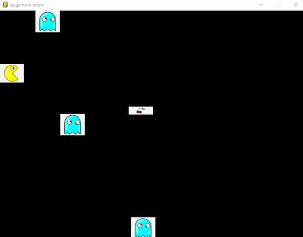

<!--- How to add gif from: https://josephcardillo.medium.com/how-to-add-gifs-to-your-github-readme-89c74da2ce47 --->

## Note
Due to this project being part of the HyperionDev bootcamp, the source code is available in a private repository.

# An overview

## A description and how it works
This program is a game (written in python, utilising pygame library), that contains 5 objects on the screen:
- the player
- 3 enemies
- a prize

The purpose of the game, is for the player to get to the prize, while at the same time dodging the 3 enemies.
If the player gets the prize, the game is won. If one of the enemies however, hits the player before getting the prize,
the game is over (player loses).

# Improvements
There are numerous additions to this program that can be made, including:
1. Cleaning up the code by utilising OOP (such as for the objects -- player, enemies and prize).
2. Adding a pause function to the game.
3. Adding additional enemy and player types that the user can choose from.
4. Making the background of the objects transparent (so that they are not all rectangular)

# Contact information
If you have any further questions, feel free to reach out to me at:
- Email: kylejulies8@gmail.com
